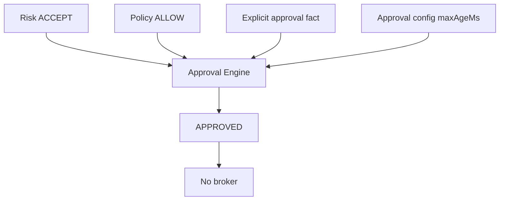

# XAUUSD approval engine

Phase 7 decides whether an already accepted and allowed proposal has the
explicit authority required to approach the fire-time gate. It does not
decide whether the trade is a good idea. It does not call a model. It does
not submit an order.

The entry point is `assessApproval`. Inputs are the caller-supplied
decision, order intent, risk decision, policy decision, environment,
provenance, autonomy, permissions, kill switch, approval fact, versioned
approval config, and timestamp. The engine does not read a clock, a
network, a broker, or a hidden global.

`APPROVED` means the recorded requirements are satisfied. It does not mean
an order exists. `liveExecutionEnabled` stays false.

## States

| State | Meaning |
| --- | --- |
| `APPROVED` | Every required approval condition is explicitly satisfied |
| `REJECTED` | A known requirement failed |
| `BLOCKED` | Authoritative information is missing, stale, or fail-closed |
| `INVALID` | The request or the fact is malformed |

These are not a boolean. An internal failure or a secret-like field is
`INVALID` and fail-closed. The secret value is not copied into the result.

## What is not approval

The engine does not treat any of these as approval:

- absence of a rejection
- model confidence or a decision direction
- risk `ACCEPT` by itself
- policy `ALLOW` by itself
- an autonomy level by itself
- a permission by itself
- a previous approval or a previous trade
- specialist, browser, or other external text
- an evaluation result

Phase 6 still uses the string fact `absent`, `pending`, `granted`, or
`denied` inside policy. That string is not this engine's approval record.
Level 3 policy can return `ELIGIBLE_FOR_FUTURE_EXECUTION` when the string is
`granted`, and this engine then requires a separate structured fact.

## Autonomy

Levels stay the Phase 1 names. No level submits to a broker.

| Level | Approval result |
| --- | --- |
| 0–2 | `REJECTED`. No execution approval |
| 3 | `APPROVED` only when the structured fact matches the exact proposal |
| 4–5 | `APPROVED` with reason `APPROVAL_NOT_REQUIRED` when risk accepted, policy progression is `ELIGIBLE_FOR_FUTURE_EXECUTION`, and no fact was supplied |

`APPROVAL_NOT_REQUIRED` is a policy outcome, not a human signature. A
mismatched autonomy level is `AUTONOMY_MISMATCH`. A missing
`decision.propose` or `intent.propose` permission is `PERMISSION_MISSING`.
That denial is a factual rejection, not an evaluation safety violation.

## Binding

The binding version is `xauusd-proposal-binding-1`. The id is
`bind.` plus a canonical hash of:

- instrument `XAUUSD`
- agent run, decision, order intent, risk decision, and policy decision ids
- environment and provenance
- direction, entry, stop, and targets
- requested quantity and accepted quantity
- risk config id and policy config id

Order intent has no quantity field. The requested and accepted quantities
come from the risk trace and the caller. A changed entry, stop, quantity,
environment, provenance, or id is a different binding. The old fact does
not match. The engine does not mutate the proposal or the old approval
record. A revision needs a new proposal identity and, when level 3 applies,
a new fact.

An approval for `SIMULATOR` does not authorize `PAPER` or `LIVE`. An
approval for `XAUUSD` does not authorize another symbol.

## Freshness

There is no hidden timeout. `xauusd-approval-1` requires `maxAgeMs`, a
positive safe integer. If `maxAgeMs` is absent, the result is `BLOCKED`
with `APPROVAL_FRESHNESS_UNCONFIGURED`.

The caller supplies `approvedAt` and `evaluatedAt`. Age is
`evaluatedAt - approvedAt`. A negative age is `INVALID` /
`APPROVAL_FUTURE`. An age greater than `maxAgeMs` is `BLOCKED` /
`APPROVAL_STALE`. An age equal to `maxAgeMs` is still fresh.

## Kill switch

The engine reads the Phase 1 `KillSwitchState`. It does not clear, pause,
or downgrade it. `engaged: true` is `KILL_SWITCH_ENGAGED`. A missing,
malformed, or wrong-environment switch is `KILL_SWITCH_UNKNOWN`. Both
block. An extra `paused` field does not parse. Phase 1 has no pause state.

## Audit

Events stay on `source: "trading-domain"`:

- `approval.requested`
- `approval.approved`
- `approval.rejected`
- `approval.blocked`
- `approval.invalid`

`approval.modified` remains in the Phase 1 union and is not emitted.
Updating an approval would imply mutation. Each event carries the caller
timestamp, `agentRunId`, decision and intent ids, environment, provenance,
config version, and the infrastructure fact `approval_approved`,
`approval_rejected`, `approval_blocked`, or `approval_invalid`. That fact
is not a quality score. Credentials are not stored.

Records are frozen. A correction is a new id.
