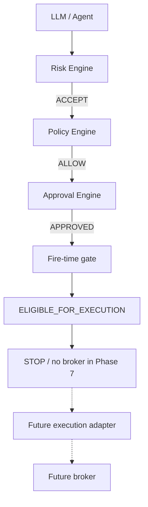

# XAUUSD fire-time execution gate

Phase 7 ends at a deterministic authorization check. The entry point is
`evaluateFireTimeGate`. The highest state is `ELIGIBLE_FOR_EXECUTION`.

That state means every deterministic gate the caller supplied has passed,
and a future execution layer may evaluate whether it is permitted to
submit. It does not mean an order exists. This phase never returns
`EXECUTED`, `FILLED`, `SUBMITTED`, or `PLACED`.

```text
                    ┌─────────────────────┐
                    │      LLM / Agent    │
                    │  Reason + Propose   │
                    └──────────┬──────────┘
                               │
                               ▼
                    ┌─────────────────────┐
                    │   Risk Engine       │
                    │ deterministic       │
                    └──────────┬──────────┘
                               │ ACCEPT
                               ▼
                    ┌─────────────────────┐
                    │   Policy Engine     │
                    │ deterministic       │
                    └──────────┬──────────┘
                               │ ALLOW
                               ▼
                    ┌─────────────────────┐
                    │  Approval Engine    │
                    │ explicit authority  │
                    └──────────┬──────────┘
                               │ APPROVED
                               ▼
                    ┌─────────────────────┐
                    │ FIRE-TIME GATE      │
                    │ fresh revalidation  │
                    └──────────┬──────────┘
                               │
                     ELIGIBLE_FOR_EXECUTION
                               │
                               ▼
                    ┌─────────────────────┐
                    │       STOP          │
                    │ No broker in P7     │
                    └─────────────────────┘
```

The future broker adapter is intentionally absent. `foundationControl.submitToBroker`,
`foundationControl.runExecutionGate`, and `foundationControl.reconcile`
still throw. The gate does not call them. It also does not call
`assessXauUsdRisk` or `assessXauUsdPolicy`. Composition stays outside the
gate: risk, then policy, then approval, then this check.



## States

| State | Meaning |
| --- | --- |
| `ELIGIBLE_FOR_EXECUTION` | Authorization passed. Nothing was submitted |
| `REJECTED` | A known rule refused progression |
| `BLOCKED` | A safety fact is missing, stale, engaged, or fail-closed |
| `INVALID` | The request is malformed, or a timestamp is in the future |
| `REQUIRES_RISK_REASSESSMENT` | Fresh risk facts no longer match the supplied `ACCEPT` |
| `REQUIRES_POLICY_REASSESSMENT` | Fresh policy facts no longer match the supplied `ALLOW` |
| `REQUIRES_APPROVAL` | Level 3 has no usable approval fact |

`liveExecutionEnabled`, `orderIntentExecutable`, and
`orderIntentBrokerSubmit` on the result are false. The gate does not write
those flags onto the intent.

## What the gate rechecks

The caller passes the instrument, decision, intent, risk decision, policy
decision, approval decision, approval fact, market fact, account equity,
exposure, environment, provenance, autonomy, permissions, kill switch,
requested quantity, and the risk, policy, approval, and gate configs. The
gate does not fetch a quote or a broker position.

The first failing check wins:

1. Secret-like fields fail closed.
2. The instrument is exactly `XAUUSD`.
3. Environment and provenance parse.
4. Gate config includes `maxMarketAgeMs`.
5. The kill switch is present, for this environment and run, and not engaged.
6. Provenance rules below.
7. Market freshness label and age.
8. Decision and intent structure. `NO_TRADE` and `WAIT` are rejected.
   `executable` and `brokerSubmit` must be false. Direction must match.
   Entry and stop must already be explicit.
9. Proposal identity matches the risk trace: decision, intent, entry, stop,
   requested quantity, and check environment.
10. Risk state is `ACCEPT`. `REJECT` stays rejected. `BLOCKED` stays blocked.
11. Risk config id, snapshot id, equity, exposure, and market provenance
    still match. A difference is `REQUIRES_RISK_REASSESSMENT`. The gate does
    not compute a new quantity.
12. A requested quantity must equal the accepted quantity. A smaller
    accepted quantity is `SILENT_REPAIR_REJECTED`.
13. Policy state is `ALLOW`. Config id or autonomy drift is
    `REQUIRES_POLICY_REASSESSMENT`.
14. Autonomy is at least 3, and progression is
    `ELIGIBLE_FOR_FUTURE_EXECUTION`.
15. `decision.propose` and `intent.propose` are present. A missing
    permission is `REJECTED`, not an evaluation safety violation.
16. The approval decision matches this binding. When a human fact is
    required, the fact is read again, bound again, and aged against
    `maxAgeMs`.

A changed proposal is `BLOCKED` / `PROPOSAL_CHANGED`. The gate does not
rewrite symbol, direction, entry, stop, targets, quantity, environment,
provenance, autonomy, approval, or the kill switch.

## Market freshness

`xauusd-gate-1` requires `maxMarketAgeMs`. If it is absent, the result is
`BLOCKED` / `GATE_FRESHNESS_UNCONFIGURED`. There is no hidden age.

Age is `evaluatedAt - marketTimestamp`, both supplied by the caller. A
negative age is `INVALID` / `MARKET_TIMESTAMP_FUTURE`. An age above the
configured maximum is `BLOCKED` / `MARKET_DATA_STALE`. A freshness label of
`stale`, or provenance `STALE`, stays stale even when the age is small.
The gate does not substitute bid, ask, close, mid, last, or a replay candle
for entry or stop.

## Environment and provenance

No fourth environment is added.

| Provenance | Gate |
| --- | --- |
| `REPLAY` | Always `BLOCKED` / `REPLAY_RESEARCH_ONLY`. Never `ELIGIBLE_FOR_EXECUTION`, including inside `SIMULATOR` |
| `UNAVAILABLE` | `BLOCKED` |
| `STALE` | `BLOCKED`. Never upgraded to `LIVE` |
| `SIMULATOR` | `SIMULATOR` environment only. It cannot authorize `LIVE` or `PAPER` |
| `LIVE` | Required for `PAPER` and `LIVE` eligibility. A `SIMULATOR` environment cannot wear `LIVE` provenance |

`PAPER` stays isolated from `LIVE`. Switching the environment after approval
does not reuse the old authorization. Replay evaluation of the same inputs
returns the same result and the same provenance.

## Kill switch

The switch stays independent of the agent, the event bus, and this gate.
Engaged or unknown blocks. The gate cannot clear it because of approval,
autonomy, confidence, or external text. Phase 1 has `engaged` only. An
extra `paused` field fails closed as `KILL_SWITCH_UNKNOWN`.

## Audit

Events stay on the existing trading-domain union:

- `execution_gate.evaluated`
- `execution_gate.eligible`
- `execution_gate.rejected`
- `execution_gate.blocked`
- `execution_gate.invalid`
- `execution_gate.requires_risk_reassessment`
- `execution_gate.requires_policy_reassessment`
- `execution_gate.requires_approval`

Each event carries `agentRunId`, the decision, intent, risk, policy, and
approval ids, the caller timestamp, environment, provenance, gate config
version, state, and reason. `gateInfrastructureFact` names
`gate_eligible` and the non-success facts. Those names are measurements.
They are not a trade-quality score, and the Phase 5 judge does not read
them. Secrets are not stored. Gate results are frozen.
