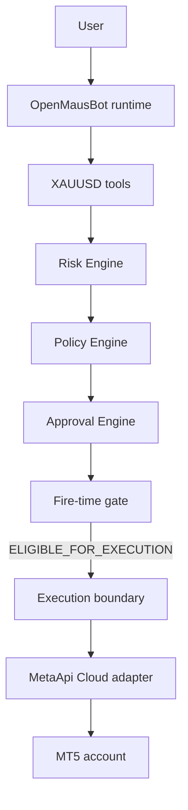

# XAUUSD MetaApi execution boundary

Phase 8 is the step from an authorized proposal to a broker submission.
MetaApi Cloud is the only MT5 execution provider. The model does not call
it. A local MetaTrader 5 terminal, a Python MetaTrader package, browser
automation, and any other broker API are not execution paths.

`foundationControl.submitToBroker()` still throws. The execution entry
point is `submitAuthorizedExecution`. It is not a tool in the XAUUSD catalog.

## Authorization

The gate result must be exactly `ELIGIBLE_FOR_EXECUTION`. `REJECTED`,
`BLOCKED`, `INVALID`, `REQUIRES_APPROVAL`, and the Phase 6 progressions
`ANALYSIS_ONLY` and `RECOMMENDATION_ONLY` stop before the provider is
called.

The boundary also checks that the supplied decision, intent, risk decision,
policy decision, and approval decision are the same records the gate names,
and that the proposal binding still matches. It does not recalculate risk,
resize quantity, or rewrite entry, stop, take profit, or direction.

`REPLAY`, `SIMULATOR`, `STALE`, and `UNAVAILABLE` provenance never reach
MetaApi. A `SIMULATOR` environment never reaches MetaApi. The Phase 1
credential slot for `SIMULATOR` is `none`.

## Account binding

The caller passes one `xauusd-metaapi-account-1` binding. There is no
"first account" selection. `PAPER` requires credential slot `paper`.
`LIVE` requires credential slot `live`. A mismatch, a missing binding, or
a provider other than `metaapi-cloud` fails closed. The binding carries an
internal `bindingId` and a region label. It does not carry the API token
or the MetaApi account id.

## Credential isolation

The token and account id are constructor arguments of
`createMetaApiExecutionAdapter`. They stay in a closure. The adapter's
enumerable fields are the provider id, the binding id, and whether it is
configured. Results, trading events, and thrown execution errors do not
copy the token, the account id, or the transport exception text. A missing
token does not call the transport and does not switch the attempt to the
simulator.

## Proposal mapping

Schema `xauusd-execution-1`. The internal direction stays `LONG` or
`SHORT`. The MetaApi body uses a pending order so the authorized entry is
the `openPrice`:

| Direction | Quote | MetaApi action |
| --- | --- | --- |
| `LONG` | entry below ask | `ORDER_TYPE_BUY_LIMIT` |
| `LONG` | entry above ask | `ORDER_TYPE_BUY_STOP` |
| `SHORT` | entry above bid | `ORDER_TYPE_SELL_LIMIT` |
| `SHORT` | entry below bid | `ORDER_TYPE_SELL_STOP` |

`ORDER_TYPE_BUY` and `ORDER_TYPE_SELL` are market orders. They are not
sent. If the entry equals the relevant quote side, or the quote snapshot
does not match the risk snapshot, the attempt is `NOT_SUBMITTED` /
`ORDER_NOT_REPRESENTABLE`.

Volume, stop loss, and a single take profit are copied. More than one
target cannot be represented as one MT5 take profit, so that proposal is
rejected. `MANAGE_EXISTING_POSITION` and `EXIT_EXISTING_POSITION` are
rejected rather than mapped to a close. MetaApi `clientId` is 26 hex
characters because MetaApi limits `comment` plus `clientId` to 26. The
full execution identity stays on the attempt record.

## Idempotency and unknown responses

The execution identity is a canonical hash of the gate, approval, proposal,
quantity, environment, provenance, and binding id. It does not use
`Math.random` or the wall clock. The same identity submitted again does
not call MetaApi.

The caller-owned ledger reserves the identity as `SUBMISSION_UNKNOWN`
before the transport returns. A timeout, a thrown transport error, an
unrecognized body, `TRADE_RETCODE_TIMEOUT`, or `TRADE_RETCODE_DONE_PARTIAL`
stays `SUBMISSION_UNKNOWN`. The next attempt is `NOT_SUBMITTED` /
`RECONCILIATION_REQUIRED`. This phase does not clear that state and does
not retry.

`TRADE_RETCODE_DONE` and `TRADE_RETCODE_PLACED` are
`SUBMISSION_ACCEPTED`. That is not a fill. `FILL_REPORTED` requires
`orderState: ORDER_STATE_FILLED`, a deal id, a fill price, and the
authorized volume. A broker volume that differs from the authorized
quantity becomes `SUBMISSION_UNKNOWN` / `BROKER_TERMS_MISMATCH` and does
not change the stored quantity.

## States

| State | Meaning |
| --- | --- |
| `NOT_SUBMITTED` | The provider was not asked to send, or credentials were absent |
| `SUBMISSION_REJECTED` | MetaApi explicitly refused the order |
| `SUBMISSION_ACCEPTED` | MetaApi acknowledged the request |
| `SUBMISSION_UNKNOWN` | The client cannot know whether MT5 received it |
| `FILL_REPORTED` | MetaApi explicitly reported a fill |

Events stay on `source: "trading-domain"`: `execution.requested`,
`execution.accepted`, `execution.rejected`, `execution.failed`,
`execution.unknown`, and `execution.filled`. They carry the run, decision,
intent, risk, policy, approval, and gate ids. They do not carry secrets.

## Kill switch

An engaged, missing, malformed, or wrong-environment switch prevents the
provider call. The adapter cannot clear the switch. Phase 1 still has only
`engaged`.

## Persistence

The in-memory ledger is still available for a single process. A restarted
process does not inherit it. Durable duplicate protection uses
`openTradingStore({ path, environment })`. The store commits the execution
identity and a `SUBMISSION_UNKNOWN` attempt before `provider.submit` is
called. The outcome is a new attempt row. The reserved row is not rewritten.

`openTradingStore()` with no arguments still throws. The call has to name
a file and an environment. PAPER and LIVE do not share a file.

If the reservation cannot be written, MetaApi is not called. If MetaApi
returns and the outcome row cannot be written, the decision stays
`SUBMISSION_UNKNOWN` and the reservation still blocks another submit.
That is not a retry. Acknowledgement is still not account truth.
`docs/trading/reconciliation.md` compares the ledger with a broker snapshot.

## What this phase does not do

It does not schedule a session, add a tool the model can call, or draw a
chart. It does not claim that the database and MetaApi commit together.
A crash after the broker call and before the outcome row leaves the
reservation `SUBMISSION_UNKNOWN`.
