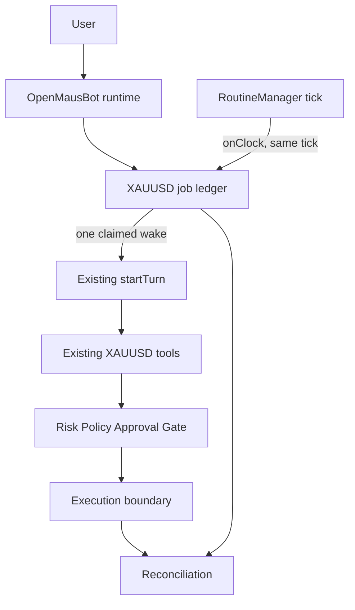

# Long-running XAUUSD jobs

Phase 10 lets a person ask OpenMausBot to watch XAUUSD for a bounded time.
The job is orchestration. It is not a second trading bot, a strategy, or a
scheduler of its own.

`RoutineManager` remains the only timer. It already wakes a bot by calling
`startTurn`. A job dispatcher may be passed as `onClock` on that same tick.
The trading store is not opened unless the caller supplies a path, so the
server does not mount a hidden ledger.

## Job

A request such as "راقب XAUUSD كل 15 دقيقة خلال الـ24 ساعة القادمة" becomes
one explicit record: XAUUSD, the caller's environment, autonomy, permissions,
a start, an end, and an interval. The environment comes from the caller. It
is not inferred, and it does not default to LIVE. A duration is required and
cannot exceed 24 hours. There is no silent renewal.

The interval uses the routine scheduler's anchor math. The next slot is
`anchor + n * interval`, not "when the last wake finished plus the interval",
so a slow wake does not drift the series.

## Wake and sleep

A due job claims one durable wake id, `wake.` plus a hash of the job and the
slot. The same slot cannot start a second turn. The claim commits before
`startTurn`. The turn id is the same hash, not a random value. The turn runs
in the job's `runtimeThreadId` through the injected starter, which is the
existing runtime's turn entry. The prompt tells the agent to read XAUUSD with
the tools it already has. It does not name an indicator or an entry rule.

The starter's promise is the end of that wake. `onClock` is awaited, so a
host that resolves the starter only when the turn has finished also keeps
the next slot from starting early. An empty routine tick stays synchronous
when no `onClock` listener is configured. After the turn is accepted, the
job sleeps until the next slot. The model is not called between wakes.
`job.created`, `job.wake.scheduled`, `job.wake.started`,
`job.wake.completed`, and `job.sleeping` are trading-domain events written
to the existing ledger. Status text is the label of that state. A job does
not invent a thinking indicator.

## Missed wakes

If the process was offline across several slots, recovery claims only the
latest slot that is still inside the job. Earlier slots are not replayed and
do not create a burst of decisions. The wake still has to read a fresh
observation. The job cannot execute unless the existing fire-time gate is
`ELIGIBLE_FOR_EXECUTION`.

When `endAt` is reached, the job completes. It does not create another day.

## Restart

Job revisions and wake claims are rows in the trading ledger. After a
restart, the latest revision is the status, including the next wake, an
approval hold, and an unresolved execution or reconciliation state. A claimed
wake is not claimed again. A cancelled or completed job does not wake.

## Approval, kill switch, reconciliation

Autonomy levels 0 and 1 and 2 cannot hand off to the execution boundary.
Level 3 holds `WAITING_FOR_APPROVAL` and does not open another approval turn
for that hold. An expired or changed proposal, quantity, stop, or environment
moves the job to `WAITING_FOR_REASSESSMENT` and does not reuse the approval.
The Phase 7 binding rules stay authoritative.

The job reads the existing kill switch and cannot clear it. `DESYNCED`,
`UNKNOWN`, and `SUBMISSION_UNKNOWN` block a handoff. They do not become a
successful trade, and the job does not submit a repair. The handoff, when
the gates allow it, is only a signal that the existing execution boundary
may be called. This module does not call MetaApi.

Pause and cancel are terminal for execution. Cancelled jobs do not wake.
Cancellation does not close a broker position.

## What this does not add

No second runtime, no second `setInterval`, no trading strategy, no chart,
no new broker, and no execution tool. Subagents are not given credentials or
a broker path by this job. Live jobs do not read replay time, and the replay
clock is not moved by the routine tick.
