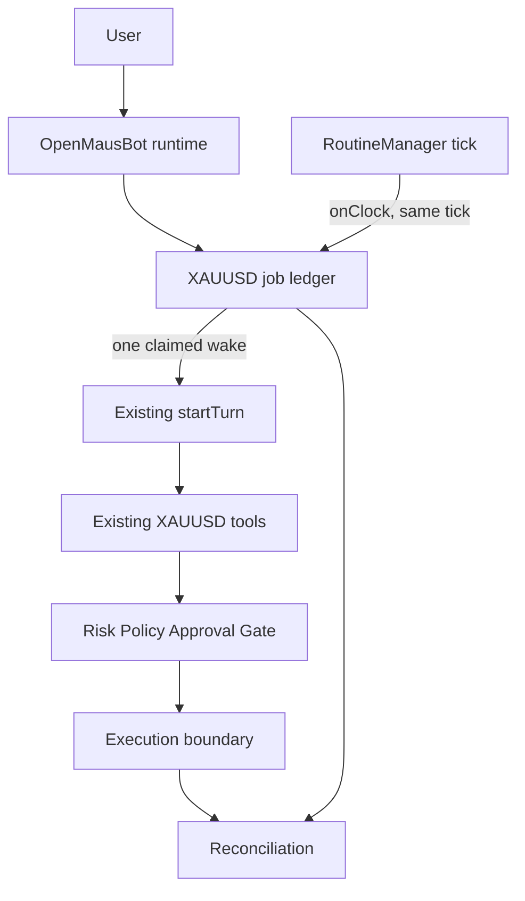

# Long-running XAUUSD jobs

Phase 10 lets a person ask OpenMausBot to watch XAUUSD for a bounded time.
The job is orchestration. It is not a second trading bot, a strategy, or a
scheduler of its own.

`RoutineManager` remains the only timer. It is constructed once, in
`server/index.ts`, and started once after the server is listening. A job
dispatcher may be passed as `onClock` on that same tick. There is no second
timer and no second dispatcher inside the job module.

## Job

A request such as "راقب XAUUSD كل 15 دقيقة خلال الـ24 ساعة القادمة" becomes
one explicit record: XAUUSD, the caller's environment, autonomy, permissions,
a start, an end, and an interval. The environment comes from the caller. It
is not inferred, and it does not default to LIVE. A duration is required and
cannot exceed 24 hours. There is no silent renewal.

The interval uses the routine scheduler's anchor math. The next slot is
`anchor + n * interval`, not "when the last wake finished plus the interval",
so a slow wake does not drift the series.

## Wake and sleep

A due job claims one durable wake id, `wake.` plus a hash of the job and the
slot. The turn id is the same hash, not a random value. The claim commits
before `startTurn`. While the row is `claimed` or `dispatching` it holds a
lease of two minutes, measured from the caller-supplied clock. A second
delivery in that window does not start a turn. After the lease, an abandoned
claim or `dispatching` row can be reclaimed. Reclaim keeps the same wake id
and the same turn id, then calls `startTurn` once. It does not call MetaApi
and it does not retry a broker submission.

`dispatched` means `startTurn` accepted that turn. That row does not expire
with the lease. The same wake is not started again. If this process no longer
reports the turn as active, the row is sealed `interrupted` and the next
schedule slot may be considered. A later slot that arrives while the turn is
still active is not started. One deferred trading event records that slot.
The job keeps a single active wake.

The turn runs in the job's `runtimeThreadId` through the injected starter,
which is the existing runtime's turn entry. The prompt tells the agent to
read XAUUSD with the tools it already has. It does not name an indicator or
an entry rule.

Job status, wake status, execution state, and reconciliation state stay on
separate fields. A running job can hold a dispatched wake, an unsubmitted
decision, and a reconciled or unknown execution at the same time.

The starter's promise is the end of that wake. `onClock` is awaited, so a
host that resolves the starter only when the turn has finished also keeps
the next slot from starting early. An empty routine tick stays synchronous
when no `onClock` listener is configured. After the turn is accepted, the
job sleeps until the next slot. The model is not called between wakes.
`job.created`, `job.wake.scheduled`, `job.wake.started`,
`job.wake.completed`, and `job.sleeping` are trading-domain events written
to the existing ledger. Status text is the label of that state. A job does
not invent a thinking indicator.

## Missed wakes

If the process was offline across several slots, recovery claims only the
latest slot that is still inside the job. Earlier slots are not replayed and
do not create a burst of decisions. The wake still has to read a fresh
observation. The job cannot execute unless the existing fire-time gate is
`ELIGIBLE_FOR_EXECUTION`.

When `endAt` is reached, the job completes. It does not create another day.

## Restart

Job revisions and wake claims are rows in the trading ledger. After a
restart, the latest revision is the status, including the next wake, an
approval hold, and an unresolved execution or reconciliation state. An
unexpired claim is not claimed again. An expired claim can be reclaimed
once, with the original wake id. A `dispatched` wake is not reclaimed into
a second turn. A cancelled or completed job does not wake. `UNKNOWN`,
`DESYNCED`, and `SUBMISSION_UNKNOWN` still block a handoff. Wake recovery
does not submit an order.

## Approval, kill switch, reconciliation

Autonomy levels 0 and 1 and 2 cannot hand off to the execution boundary.
Level 3 holds `WAITING_FOR_APPROVAL` and does not open another approval turn
for that hold. An expired or changed proposal, quantity, stop, or environment
moves the job to `WAITING_FOR_REASSESSMENT` and does not reuse the approval.
The Phase 7 binding rules stay authoritative.

The job reads the existing kill switch and cannot clear it. `DESYNCED`,
`UNKNOWN`, and `SUBMISSION_UNKNOWN` block a handoff. They do not become a
successful trade, and the job does not submit a repair. The handoff, when
the gates allow it, is only a signal that the existing execution boundary
may be called. This module does not call MetaApi.

Pause and cancel are terminal for execution. Cancelled jobs do not wake.
Cancellation does not close a broker position.

## Production mount

The process does not open a trading database.

`OMB_DATA_DIR` (default `~/.openmausbot`) is the app home. It is not a
trading partition. PAPER and LIVE cannot share a file, and the environment
must be named by the caller. There is no default path and no default of LIVE.

`readXauUsdJobMount` reads `OMB_XAUUSD_STORE_PATH` and
`OMB_XAUUSD_ENVIRONMENT` together. If both are absent it reports that the
mount is off and creates nothing. If only one is set it throws and creates
nothing. It does not join either value onto the app home.

`server/index.ts` does not call that function and does not pass `onClock`.
The production `startTurn(botId, text, { threadId })` does not accept or
return the job's deterministic `runtimeTurnId`, and a job row has no bot id.
Connecting the dispatcher there would reject every wake or change chat turn
identity. That wiring stays out until a turn can keep the job's turn id.

## What this does not add

No second runtime, no second `setInterval`, no trading strategy, no chart,
no new broker, and no execution tool. Subagents are not given credentials or
a broker path by this job. Live jobs do not read replay time, and the replay
clock is not moved by the routine tick.
