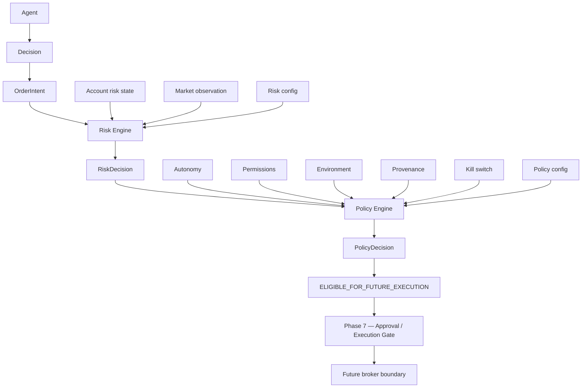

# XAUUSD policy engine

Phase 6 decides whether a proposal is allowed to move toward a future
execution boundary. It does not decide whether the trade is a good idea.
It does not call a model. It does not submit an order.

Policy runs only after the risk engine returns `ACCEPT`. A risk rejection
or block never becomes eligibility. The composition entry point is
`evaluateXauUsdProposal`.

`ELIGIBLE_FOR_FUTURE_EXECUTION` means a later gate may look at the proposal.
It does not mean execute. `liveExecutionEnabled` stays false.
`orderIntent.executable` and `orderIntent.brokerSubmit` stay false. Policy
does not write those fields.

## States

| State | Meaning |
| --- | --- |
| `ALLOW` | The action may progress as far as the recorded progression |
| `REJECT` | A known rule refuses the action |
| `BLOCKED` | A safety fact is missing or engaged |
| `INVALID` | The policy input is malformed |

Progression, set only when the state is `ALLOW`:

| Progression | Meaning |
| --- | --- |
| `ANALYSIS_ONLY` | Autonomy 1, and the decision is `NO_TRADE` or `WAIT` with no intent |
| `RECOMMENDATION_ONLY` | Autonomy 2, or a higher level with no order to carry forward |
| `ELIGIBLE_FOR_FUTURE_EXECUTION` | Autonomy 3 with approval granted, or autonomy 4 or 5, and every other gate passed |
| `NONE` | The state is not `ALLOW` |

An allow is a Phase 1 `PolicyCheck` with status `PASSED`. A reject or
invalid result is `FAILED`. A block is `UNAVAILABLE`. The policy schema is
`xauusd-policy-1`. The composition schema is `xauusd-proposal-1`.

## Autonomy

Levels stay the Phase 1 names. None of them submit to a broker.

| Level | Name | Phase 6 result |
| --- | --- | --- |
| 0 | `OBSERVE` | Rejects proposal progression |
| 1 | `ANALYZE` | Analysis only for `NO_TRADE` or `WAIT`. A directional proposal is rejected |
| 2 | `RECOMMEND` | Recommendation only. Not eligible |
| 3 | `REQUIRE_APPROVAL` | Eligible only when the caller passes approval `granted` |
| 4 | `EXECUTE_UNDER_POLICY` | Eligible when risk, permissions, provenance, and the kill switch pass |
| 5 | `AUTONOMOUS_MONITORING` | Same bounds as level 4. It does not skip risk or the kill switch |

Approval at this layer is an input fact: `absent`, `pending`, `granted`, or
`denied`. Level 3 treats anything other than `granted` as
`APPROVAL_REQUIRED`. That rejection is a policy result, not an agent safety
violation. The string is not the Phase 7 approval record. The structured
fact and its binding are `docs/trading/approval.md`.

Permissions are the Phase 3 set. A decision needs `decision.propose`. An
order intent also needs `intent.propose`. The model cannot add a permission.
No new permission was added.

## Environment and provenance

`SIMULATOR`, `PAPER`, and `LIVE` stay distinct. Execution is disabled in all
three.

| Provenance | Rule |
| --- | --- |
| `REPLAY` | Research inside `SIMULATOR` only. It cannot authorize `PAPER` or `LIVE`, and it cannot become eligible |
| `SIMULATOR` | `SIMULATOR` environment only. It cannot authorize `LIVE` |
| `LIVE` | Required for eligibility in `PAPER` or `LIVE`, with freshness `fresh` |
| `STALE` | Never upgraded. It cannot become eligible |
| `UNAVAILABLE` | Blocks |

A `SIMULATOR` environment can become eligible on fresh `SIMULATOR`
provenance. That eligibility is still not execution.

## Kill switch

Policy reads the Phase 1 `KillSwitchState`. `engaged: true` blocks every
progression, including autonomy 5. A missing, malformed, or wrong-environment
switch is `KILL_SWITCH_UNKNOWN` and blocks. The engine cannot clear
`engaged`. A specialist cannot clear it. A tool cannot clear it.

Phase 1 has one flag, `engaged`. It does not have a separate pause state.
`agent.paused` and `emergency.stop` are event names, not a second control
object. An extra `paused` field does not parse, so the switch is unknown
and the proposal blocks. Pause is not modeled as a quieter version of the
engaged flag.

## Audit

Trading events stay on `source: "trading-domain"`. They are not
`RuntimeEvent`s. The engines emit:

- `risk.check.started`, `risk.check.passed`, `risk.check.failed`, `risk.check.blocked`
- `policy.check.started`, `policy.check.passed`, `policy.check.failed`, `policy.check.blocked`
- `proposal.eligible` only for `ELIGIBLE_FOR_FUTURE_EXECUTION`

Ids are hashes of the inputs and the caller-supplied `assessedAt`. They do
not use the wall clock or a random source. Correlation uses
`evaluationRunId` when the caller passes one, otherwise the decision id.

## What this engine does not do

It does not repair a proposal, raise autonomy, edit `RiskConfig`, or disable
the kill switch. It does not trust `policyAllowed` from model output.
External evidence stays behind the Phase 3 fence and cannot change risk,
policy, approval, execution, or the switch. The fire-time gate revalidates
immediately before any future broker submit and then stops. It is
`docs/trading/execution-gate.md`. It does not submit.
