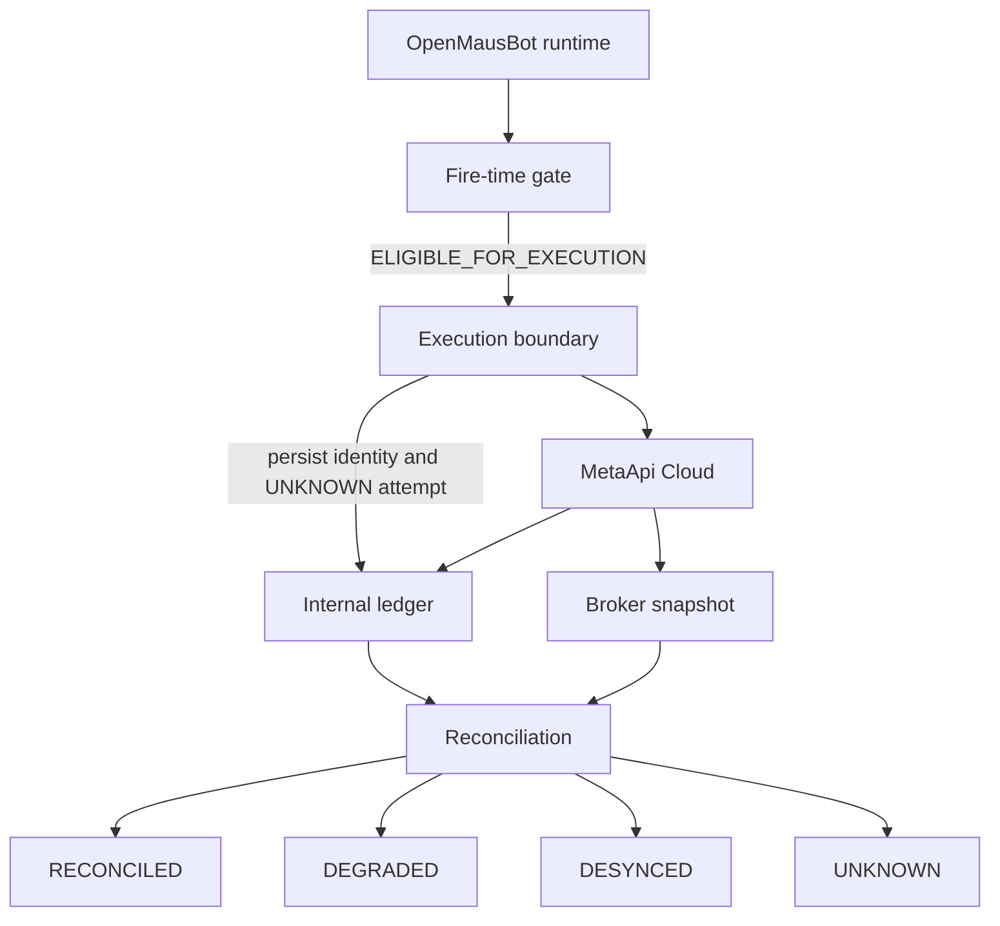

# XAUUSD reconciliation

Phase 9 records what the execution boundary asked MetaApi to do, and
separately records what a later read of the MT5 account reported. Those
are different facts. The ledger is not broker truth. An HTTP or SDK
acknowledgement is not proof that a position exists.

`foundationControl.reconcile()` still throws. The comparison entry point is
`reconcileExecution`. It does not submit, approve, or change the fire-time
gate. `captureBrokerSnapshot` only reads. It has no submit method.

## Two truths

Internal truth is the execution request and its attempts: the authorized
proposal, the client correlation id, and each response the process managed
to record.

Broker truth is one immutable `BrokerAccountSnapshot`: orders, deals,
positions, and account figures reported at a caller-supplied `observedAt`.
A later read is a new snapshot. Snapshots are not merged, and they do not
rewrite market-data provenance.

## Ledger

`TRADING_STORE_SCHEMA_VERSION` is `1`. The file is `node:sqlite`, the same
engine the chat transcript store uses, in a different file. A zero-argument
`openTradingStore()` or `applyTradingMigrations()` throws
`trading_store_not_implemented`. The caller passes `path` and `environment`.
A file bound to PAPER rejects a LIVE open.

Version `0` is the pre-ledger state. The migration creates tables and, when
a version `0` row exists, sets the version to `1`. It does not drop or
delete trading rows. A second reconciliation of the same inputs and the
same caller timestamp keeps the first row. A later caller timestamp inserts
a new run.

The lifecycle stays in separate rows:

1. Execution request, written once.
2. Attempt sequence 1, `SUBMISSION_UNKNOWN`, committed before MetaApi.
3. Later attempt sequences for the outcome the process actually recorded.
4. Broker orders, deals, and positions on a snapshot.
5. A reconciliation run and its findings.

Broker order ids stay on the broker rows. They do not replace
`executionIdentity` or `executionRequestId`. The correlation key is the
26-character `clientId` already sent on the MetaApi command.

## UNKNOWN

`SUBMISSION_UNKNOWN` survives a process restart. It does not become
`SUBMISSION_ACCEPTED`, `SUBMISSION_REJECTED`, or `NOT_SUBMITTED` by itself.
Another submit for that identity returns `RECONCILIATION_REQUIRED` and does
not call MetaApi.

A crash after the reservation commit and before the broker call also leaves
`SUBMISSION_UNKNOWN`, even if the request never left the process. The store
and MetaApi are not one transaction. The safe behavior is to keep the
reservation and reconcile. This is durable idempotency, not exactly-once
delivery.

If the outcome cannot be persisted after MetaApi returns, the caller still
sees `SUBMISSION_UNKNOWN`. The reserved row remains. There is no automatic
retry.

## States

| State | Meaning |
| --- | --- |
| `RECONCILED` | The compared facts agree |
| `DEGRADED` | Data is incomplete and nothing read contradicts the ledger |
| `DESYNCED` | A read fact contradicts the ledger |
| `UNKNOWN` | The relationship cannot be decided safely |

`DESYNCED` and `UNKNOWN` still block autonomous orders through the Phase 1
helper. Reconciliation does not clear a kill switch. It may report whether
the switch it was shown is engaged.

An accepted internal attempt plus one order with the same `clientId`,
symbol `XAUUSD`, and authorized volume is `RECONCILED` with `ORDER_MATCHED`.
That is not a fill.

`SUBMISSION_UNKNOWN` plus that same order is `RECONCILED` with resolution
`UNKNOWN_TO_BROKER_ORDER_FOUND`. The original attempt row stays
`SUBMISSION_UNKNOWN`. The resolution is a new reconciliation record. The
events are `reconciliation.started`, `reconciliation.completed`, and
`execution.resolved`.

`SUBMISSION_UNKNOWN` plus no matching order on a complete snapshot stays
`UNKNOWN` (`BROKER_ORDER_NOT_FOUND`). Absence is not a failure and not a
retry. An incomplete or unread order list stays `UNKNOWN`
(`SNAPSHOT_INCOMPLETE`). A broker read that does not return stays `UNKNOWN`
for an unknown attempt and `DEGRADED` for an accepted attempt
(`BROKER_UNAVAILABLE`). The engine does not invent orders.

## Matching

An order matches only when `order.clientId` equals the persisted `clientId`.
Symbol plus direction is not a match. Two orders with the same client id are
`DESYNCED` / `AMBIGUOUS_CORRELATION`. A different client id is a different
order, including an older XAUUSD order.

A matched symbol other than `XAUUSD` is `DESYNCED` / `SYMBOL_MISMATCH`.
Other symbols are `FOREIGN_SYMBOL_OBSERVED`. They are not relabeled
`XAUUSD`.

A matched volume other than the authorized quantity is `DESYNCED` /
`QUANTITY_MISMATCH`. The request quantity is not rewritten.

Deals contribute only when their client id matches, or their client id is
absent and their order id is the matched order. A deal sum below the
authorized quantity is `DEGRADED` / `PARTIAL_FILL` and stores the deal
volume that was read. It is not a full fill and it does not submit the
remainder. A deal sum equal to the authorized quantity is `FILL_MATCHED`.
A larger sum is `DESYNCED` / `OVERFILL`.

Positions are stored on their own rows. A position does not match an
execution. `POSITION_UNCORRELATED` can appear beside a reconciled order.
An order is not a position, and a deal is not a position.

The snapshot's binding id and environment must equal the request. A
different account is `DESYNCED` / `ACCOUNT_MISMATCH`. PAPER against a LIVE
snapshot is `DESYNCED` / `ENVIRONMENT_MISMATCH`. A missing binding id is
`UNKNOWN`. SIMULATOR and any provenance other than `LIVE` do not become
broker truth (`UNKNOWN` / `NON_EXECUTABLE_ENVIRONMENT`).

`captureBrokerSnapshot` does not call the reader for `SIMULATOR`, for
provenance other than `LIVE`, or when the binding environment disagrees
with the requested environment. There is no installed MetaApi SDK in this
repository, so the read path is an injected reader. The module does not
guess REST URLs. The token and MetaApi account id stay in the adapter
closure. They are not snapshot fields.

The snapshot id is a hash of the canonical observation, including the
caller-supplied `observedAt`. The same observation produces the same id.
`reconcileExecution` does not call the network, `Date.now`, or `Math.random`.

## What reconciliation does not do

It does not place, close, resize, or modify an order. It does not change
stop, target, quantity, direction, symbol, environment, or account. It does
not clear the kill switch. It does not create an approval or a fire-time
authorization. A `DESYNCED` result is a record for a later operator policy.

A future monitor can call the same pure function on new snapshots. That
monitor is not this phase. Phase 10 is not started.
