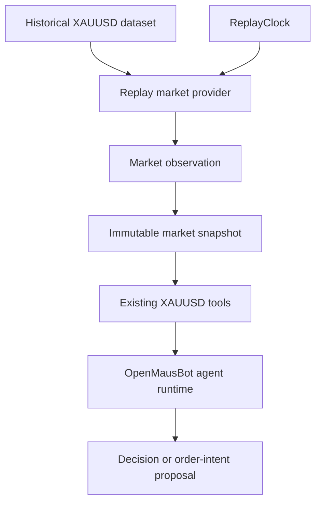

# XAUUSD market replay

Phase 4 adds deterministic historical time to the existing XAUUSD market-data
boundary. OpenMausBot remains the only agent runtime. Replay does not start a
turn, choose the next tool, or submit an order.

## Replay clock

`createReplayClock` belongs to one session. It stores `startAt`, `endAt`, and
`currentAt` as UTC instants. `advanceTo` and `advanceBy` are the only ways
the clock moves. The same instant is a no-op. An earlier instant is rejected.
Time past `endAt` is rejected. `advanceBy` calls the same move as
`advanceTo`. The clock does not sleep and does not read wall-clock time.

An offset such as `+02:00` is converted to `Z`. A timestamp without a zone is
rejected. The clock's timezone field is `UTC`.

## Replay session

`createReplaySession` names `replaySessionId`, the dataset id, dataset
version, dataset fingerprint, config version `xauusd-replay-1`, and clock
version `xauusd-replay-clock-1`. The instrument is `XAUUSD`. The environment
is `SIMULATOR`. Provenance is `REPLAY`.

The session id is a hash of the dataset fingerprint, the canonical timeframe
set, the start, the end, the caller clock limits, and the forming policy. It
does not include a random id or the wall clock. Timeframes are stored in
canonical order: `M1`, `M5`, `M15`, `M30`, `H1`, `H4`, `D1`. That order is
not a substitution of one timeframe for another. Aliases such as `15m` are
rejected on the session config.

`bindReplayGrant` copies the replay provider onto an opt-in tool grant.
`PAPER` and `LIVE` are rejected. The grant does not keep another provider.
Tool calls read `marketClock()` at invocation time, so a later `advanceTo`
is visible. The model has no tool that advances the clock.

## Dataset

`createReplayDataset` accepts a local fixture only. There is no OANDA,
MetaApi, or MT5 client. The contract is:

- schema version `1`
- dataset id and dataset version
- instrument `XAUUSD`
- source label
- timezone `UTC`
- coverage start and end
- quotes, candles, and optional prints

The fingerprint is a sha256 of canonical JSON. Object key order does not
change it. A caller-supplied `contentHash` that does not match is rejected.
Changing a bar changes the fingerprint. The dataset is frozen. Extra fields,
including control fields such as `autonomy`, are rejected. Secret field names
are rejected.

Malformed timestamps, impossible OHLC, duplicate bars, misaligned opens,
wrong instrument, unknown timeframe keys, bid above ask, and bars outside
coverage fail closed. Nothing is repaired or forward-filled.

## Knowability

A candle has an open time and a close time. The close is the open plus the
Phase 2 length of its timeframe. The candle is closed only when replay time
is at or after that close. The replay provider itself omits every other bar.
A later check throws if a future bar still appears. Phase 2 still rejects a
series that contains a future bar; replay does not trim one after acceptance.

At `2026-08-15T14:30:00.000Z`, the last closed opens are:

| Frame | Last closed open | That bar's close |
| --- | --- | --- |
| M1 | 14:29 | 14:30 |
| M5 | 14:25 | 14:30 |
| M15 | 14:15 | 14:30 |
| M30 | 14:00 | 14:30 |
| H1 | 13:00 | 14:00 |
| H4 | 08:00 | 12:00 |
| D1 | previous UTC day | 00:00 on this day |

At `14:29:59` the M15 bar that opened at `14:15` is not closed. At `14:30:00`
it is. At `14:30:01` the bar that opened at `14:30` is still not closed.

The quote is the latest dataset quote at or before replay time. A later quote
is not returned. Its timestamp is not rewritten to replay time.

## Closed bar, forming bar, quote

These stay separate.

- A closed bar is the dataset OHLC after its close time.
- A forming bar is built only from explicit prints whose time is inside the
  open interval and at or before replay time. A print at the close belongs to
  the next interval. Open is the first print, close is the last, and high and
  low do not depend on order. Volume is included only when every print has
  volume. Bid and ask are not turned into a synthetic print. If there is no
  eligible print, the status is `unavailable` with reason `insufficient-data`.
- The quote is bid, ask, and spread. It is not a candle.

The forming bar is not copied into `MarketSnapshot.candles`. Once a bar has
closed, its dataset OHLC is the closed record. That OHLC is not used while
the bar is still forming.

## Observation and snapshot

One observation is one replay time. It carries the quote, the closed series
for the configured timeframes, the forming state, provenance `REPLAY`,
freshness, dataset identity, session id, quality, and a content hash.

Quality is:

- `UNAVAILABLE` when replay time is outside dataset coverage, or when no
  quote and no closed bar is knowable.
- `PARTIAL` when a knowable series has a missing bar, or the dataset has
  quotes but none are knowable yet.
- `COMPLETE` when every expected closed bar is present and a quote is present
  if the dataset has any. A missing forming reconstruction does not lower
  `COMPLETE`.

Missing bars are not invented. An observation outside coverage does not clamp
to the last bar. A direct candle read still returns only bars that have
already closed; it does not return future bars.

The sealed snapshot uses the Phase 1 parser. Its id is `snap-` plus the hash
of the quote and closed bars. The observation id is `obs-` plus the hash of
that state plus the forming bar and quality. Agent run id and manifest id are
stored on the snapshot and are not part of the hash. The same market inputs
produce the same hash. A later dataset version has a new fingerprint, so its
observation id changes even when the visible bars at that instant match.

The snapshot's `providerTimestamp` is the latest included quote time or
closed-bar close. `capturedAt` is the replay time. Freshness is the worst
freshness of the included parts. Provenance stays `REPLAY` when a part is
stale. The Phase 1 candle list holds at most 2048 bars. A larger observation
fails closed and does not drop bars.

Snapshots and observations are frozen. A later `advanceTo` creates a new
observation. The previous object is not updated.

## Ordering and events

Dataset events sort by time, then kind (`quote`, then `print`, then
`candle`), then timeframe index, then the index in the submitted array.
Candle opens are unique per timeframe, so that last key matters for prints
that share a timestamp. Object key order is not used.

Replay writes the existing `trading-domain` events:

- `market.replay.started`
- `market.replay.advanced`
- `market.snapshot.created`
- `market.replay.completed`
- `market.replay.failed`

Each one carries the session id, replay time, instrument, dataset version,
and the investigation's `agentRunId`. Thread and turn ids are copied when the
session was given them. Replay does not emit `agent.thinking`. A session
requires an `agentRunId` because every trading event requires one. That id
correlates the investigation. It is not a second agent runtime.

## Isolation

Replay runs in `SIMULATOR` with credential slot `none`. It does not read
credentials, open a broker connection, or mutate positions. A decision or
order intent created from a replay observation stays non-executable.
`REPLAY` on `PAPER` or `LIVE` is rejected.

## Open questions

- Forming bars are built only from explicit prints. Reconstructing OHLC from
  bid and ask would invent a print. A later phase can decide whether a quote
  may be used as a print.
- There is no fourth trading environment. Historical replay uses `SIMULATOR`
  plus provenance `REPLAY`, so it is not labeled `LIVE` and `SIMULATOR`
  provenance still means synthetic data.
- Every trading event requires `agentRunId`. A replay session therefore
  requires an investigation id even when no model is running. Replay does not
  emit `agent.thinking`.
- No historical vendor adapter is approved. Phase 4 uses local fixtures.
- CLI engines still do not mount this in-process catalog.
- A unified snapshot uses the Phase 1 limit of 2048 closed bars. A longer
  knowable history fails closed instead of dropping bars.
- Adding bars changes the dataset fingerprint. An observation at the same
  instant then has a new id even when the visible bars match. That keeps
  dataset identity honest. It does not rewrite the older observation.

## What this phase does not implement

P&L, fills, spread or slippage models, commissions, position accounting,
strategy scoring, optimization, walk-forward, and model benchmarking. Risk,
policy, the execution gate, reconciliation, and the kill switch are still
unimplemented boundaries. Phase 5 evaluation
(`docs/trading/evaluation.md`) runs the existing tool session against this
replay and records what it did. It does not score a strategy or compute P&L.
