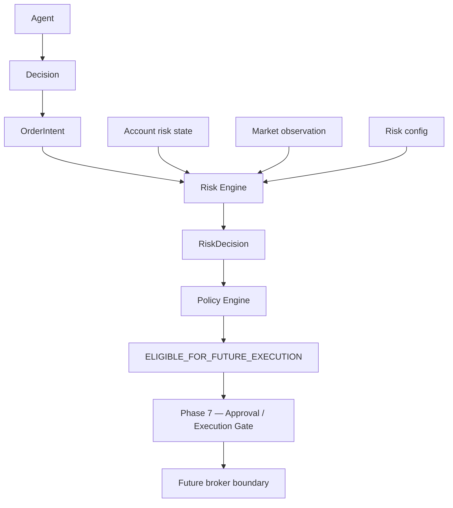

# XAUUSD risk engine

Phase 6 calculates the monetary risk of a proposed XAUUSD action. It does
not decide whether the market should be bought or sold. The agent proposes a
`Decision` and, when the direction needs one, an `OrderIntent`. The risk
engine checks that proposal against an explicit account, an explicit market
quote, and a versioned config.

The engine does not call a model, a broker, or the network. It does not read
the wall clock. The same inputs produce the same `RiskDecision`.



Phase 6 stops before the execution gate. `ELIGIBLE_FOR_FUTURE_EXECUTION` is
not an order.

## Contract

The only instrument is `XAUUSD`. `EURUSD`, `GBPUSD`, gold aliases, `XAU/USD`,
and `XAU-US` are invalid. They are not rewritten into `XAUUSD`.

| Field | Value |
| --- | --- |
| Version | `xauusd-contract-1` |
| Symbol | `XAUUSD` |
| Contract size | 100 troy ounces per 1 lot |
| Quantity unit | lot |
| Price unit | USD per troy ounce |

Lot minimums, maximums, and steps come from `RiskConfig` when the caller sets
them. The contract does not encode leverage or margin. Margin is not risk.

Schema version of the calculation is `xauusd-risk-1`.

## True equity risk

`maxRiskPercent` is a fraction of authoritative equity. `0.01` means one
percent of equity, not one percent of the entry price.

```text
riskBudget = equity × maxRiskPercent
```

If `maxRiskAmount` is set, the budget is the smaller of that amount and the
percent budget. The trace records this equity budget.

```text
stopDistance = abs(entryPrice - stopPrice)
riskPerLot = stopDistance × 100
```

`100` is the contract size in ounces. Risk is not `abs(entry - stop) / entry`.

A derived quantity is `riskBudget / riskPerLot`, then reduced by any
configured position cap and exposure cap. When `quantityStep` is set, the
derived quantity uses rounding mode `floor`:

```text
accepted = floor(quantity / step) × step
```

The monetary risk is recalculated after the floor. The accepted quantity is
reduced by further steps if that risk would still exceed the sizing budget.
A requested quantity is not rounded and it is not reduced. If it is
off-step, the result is `QUANTITY_STEP_INVALID`. If its risk exceeds the
budget, the result is `RISK_BUDGET_EXCEEDED`. If it exceeds
`maxPositionQuantity`, or a manage/exit request exceeds the known open
lots, the result is `POSITION_SIZE_EXCEEDED`. The trace keeps
`requestedQuantity` and may show `maximumAllowedQuantity`. It does not
replace the request with that smaller size. An accepted request is the
requested quantity.

## Stops, entries, and targets

A long, short, manage, or exit intent must carry the entry and the stop.
The engine does not copy a stop from the decision, invent one, or replace
the entry with the bid, ask, or last close.

- Long: `stop < entry`
- Short: `stop > entry`
- Manage or exit: the same rule against the known exposure side

A missing stop, a non-finite stop, a stop on the wrong side, or a zero
distance fails closed. Targets are optional. When present they must be
finite, on the profit side of the entry, and the same list as the decision.
The engine does not score reward to risk.

`NO_TRADE` and `WAIT` are valid and must not carry an order intent.

## Account and exposure

The caller supplies `AccountRiskState`: equity, currency `USD`, exposure
side (`none`, `long`, `short`, or `unknown`), exposure lots, open risk,
`asOf`, provenance, freshness, and a source id and version. This is a
fixture or another explicit input. It is not a broker account adapter.
Tests do not label that fixture `LIVE`.

`unknown` exposure fails closed when the action is manage or exit, or when
`maxOpenExposure` is set. The engine does not assume zero and does not net
a long against a short. A new long or short counts absolute lots:
`existing lots + accepted lots`. Manage and exit cannot size above the
known open lots.

`maxConcurrentRisk`, when set, needs `openRiskAmount`. The sizing budget is
then also limited by `maxConcurrentRisk - openRiskAmount`. A missing open
risk blocks. The trace's `riskBudget` stays the equity budget.

Freshness uses the existing market labels. There is no hidden number of
seconds. `rejectStaleMarket: true` blocks a stale or unavailable quote.
Omitted or `false` does not invent that limit. The entry still has to be on
the intent. A stale or unavailable account always blocks.

## States

| State | Meaning |
| --- | --- |
| `ACCEPT` | The calculation fits every configured limit |
| `REJECT` | The input is usable and breaks a limit |
| `BLOCKED` | Equity, exposure, or market facts are missing, stale, or unknown |
| `INVALID` | The contract is malformed |

`ACCEPT` is also a Phase 1 `RiskCheck` with status `PASSED`. `REJECT` and
`INVALID` are `FAILED`. `BLOCKED` is `UNAVAILABLE`. Non-pass results are
fail-closed. The precise state is on `RiskDecision`, not only on the coarse
check.

The trace stores equity, the percent, the budget, entry, stop, distance,
contract size, risk per lot, requested quantity, calculated maximum,
accepted quantity, rejected quantity, resulting amount, resulting percent,
exposure, and the config version.

## What this engine does not do

It does not repair a proposal. It does not set `executable` or
`brokerSubmit` to true. It does not place, modify, or cancel an order. It
does not compute P&L, fills, or a strategy. A field such as `riskApproved`
on the input is ignored. Credentials are rejected and are not copied into
the decision. The fire-time gate rechecks this result and does not
recompute a quantity. See `docs/trading/execution-gate.md`.
